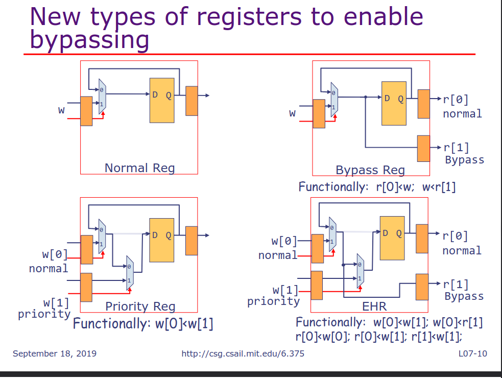

# Incresing concurrency using bypasses and EHRs
## Up-Down counter
```bsv
module mkUpDownCounter (UpDownCounter);
    Reg#(Bit#(8)) ctr <- mkReg (0);
    method ActionValue#(Bit #(8)) up if (ctr < 255);
        ctr <= ctr+1; return ctr;
    endmethod
    method ActionValue#(Bit #(8)) down if (ctr > 0);
        ctr <= ctr-1; return ctr;
    endmethod
endmodule
```
> up and down 不会同时执行
- methods up and down 可以同时处于`ready`状态, 但是无法并发的执行
```bsv
UpDownCounter Bit#(8) x
    <- mkUpDownCounter;
rule producer;
    ... x.up ...;
endmethod
rule consumer;
    ... x.down ...;
endmethod
```
- 因为如果`up and down`同时执行会在一个时钟周期内对寄存器`ctr`写两次,这是不允许的
- 所以`rules`的`producer`和`consumer`不能并发的执行
### 如何避免`double write`
> 当`producer`的`rdy`信号为高时,将`consumer`的`en`信号置为低
> 阻止`consumer`更新状态, 这样就不会出现`double write`
### 如何设计`up and down`不会冲突的`method`
> 使用`pipeline`
- 在流水线系统中这些`rules`必须并发的执行
    - 只有`fifo`允许`deq and enq`, 流水线就能并发的执行
    - 但是在单元素的`fifo`中, `deq and enq`是互斥的->`no pipeline`
```bsv
module mkFifo (Fifo#(1, Bit#(n)));
    Reg#(Bit#(n)) d <- mkRegU;
    Reg#(Bool) v <- mkReg(False);
    method Action enq(Bit#(n) x) if (!v);
        v <= True; d <= x;
    endmethod
    method Action deq if (v);
        v <= False;
    endmethod
    method Bit#(n) first if (v);
        return d;
    endmethod
endmodule
```
>  那我们应该如何让`fifo's enq and deq`能够并发的执行呢
- 增加`fifo`中的寄存器的数量, 可以在`fifo`队列中存放多个数据
### 设计并实现一个`two-element fifo`
- 首先,初始化`va and vb`为`False`
- 第一次执行`enq`会把数据存在`da`, 并标记`va`为`True`
- 只有`fifo`中没有满, 就可以执行`enq`
- 只要`fifo`中不为空, 就可以执行`deq`
- 如果只有一个数据, 那么他会被放在`da`
```txt
    |vb| |va|
--->|  | |  |--->
    |db| |da|
```
#### 寄存器的限制
- 只使用寄存器, 在同一个时钟周期无法进行通信, 在以下情况:
    - two methods
    - two rules
    - a rule and a method
- 为了提高性能必要的时候可以绕过`rules and methods`之间的值
### Bypassing(旁路) in Bluespec

1. 普通寄存器:
    - 功能: 只有一个写入端口和一个输出端口
    - 行为: 直接将输入的数据写入寄存器, 并在下一个周期将数据传递到输出端
2. 旁路寄存器:
    - 功能: 相比于普通的寄存器增加了一个旁路功能, 可以直接将输入端口的数据传递到输出端
    - 行为:
        - `r[0]`: 将输入端口的数据正常写入寄存器
        - `r[1]`: 旁路输出, 直接将输入端口的数据输出
    - functionally: `r[0]<-w, w<-r[1]`
3. 优先级寄存器:
    - 功能: 寄存器有两个输入端口`w[0] and w[1]`, 其中`w[1]`具有更高的优先级
    - 行为:
        - `w[0]`: 正常写入端口
        - `w[i]`: 优先级写入端口, 如果有数据就会把这个端口的数据写入寄存器
    - functionally: `w[0] <- w[1]`
4. EHR（Enhanced Hybrid Register，增强混合寄存器）
    - 功能：结合了旁路和优先级的功能。
    - 行为：
        - w[0] 和 w[1]：两个写入端口，w[1] 具有更高优先级。
        - r[0] 和 r[1]：两个读出端口，r[1] 是旁路输出。
    - functionally：`w[0]<-w[1]; w[0]r[1] r[0]<-w[0]; r[0]<-w[1]; r[1]<-w[1]`
#### EHR
- r[1] returns:
    - the current state if w[0] is not enabled
    - the value being written if w[0] is enabled
- `w[1]`的优先级比`w[0]`高
    - 使用`EHR`可以增强设计的并发性, 同时也带来了关键路径变长的问题
### 使用`EHR`实现`up and counter`
```bsv
module mkUpDownCounter (UpDownCounter);
    Ehr#(2, Bit#(8)) ctr <- mkEhr (0);
    method ActionValue#(Bit#(8)) up if (ctr[0] < 255);
        ctr[0] <= ctr[0]+1; return ctr[0];
    endmethod
    method ActionValue#(Bit#(8)) down if (ctr[1] > 0);
        ctr[1] <= ctr[1]-1; return ctr[1];
    endmethod
endmodule
```
> assuming functionally we want to execute up before down
- method down will the see the ctr value being written by method up
- method down's write of ctr value will overwrite the ctr write by method up
- the functionality of this counter is the same as the using registers, except for one edge case
    - EHR version would allow method dowen to be executed even when ctr is 0 provided method up is executed at the same time
> 不会出现`double write`的问题, 但是关键路径会更长
## Conflict Matrix
- ra < rb : ra and rb can be executed concurrently; the net effect is as if ra executed before rb
- ra CF rb: ra and rb can be executed concurrently; the net effect is the same as (ra<rb) and (rb<ra)
- ra C rb: ra and rb Conflict; either the concurrent execution will cause a double-write error or the resulting effect is neither (ra<rb) nor (rb<ra)
- ra ME rb: the guards of ra and rb are mutually exclusive and thus, ra and rb can never be rdy together- ra < rb: 
> 6.175 fifo lab4 也提到了相关的内容
> 后面是几种`fifo`使用`EHR`的具体实现(http://csg.csail.mit.edu/6.375)
# 并发执行的规则的串行性
序列化要求任何并发执行的规则集合都必须等效于这些规则按照某种顺序逐一执行的结果。这保证了无论规则如何并发执行，最终系统的状态与某个顺序执行的状态是一致的。

Any legal behavior of a Bluespec program can be explained by observing the state updates obtained by applying one rule at a time
## why is serializability important
- As you have seen it is straight forward to build hardware so that ra and rb will execute concurrently. However, in general, it is difficult to derive the behavior of the resulting circuit
- Serializability, lets us apply one rule at a time in some order to derive the behavior of the composite system
- Without serializabilty, the atomicity of each rule has no meaning in a complex system
- Even though serializability imposes an additional constraint, and will make us reject some RTL implementations for a Bluespec design, in practice its advantages far outweigh its disadvantages in debugging and verification
