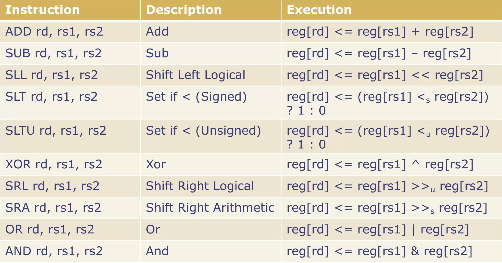
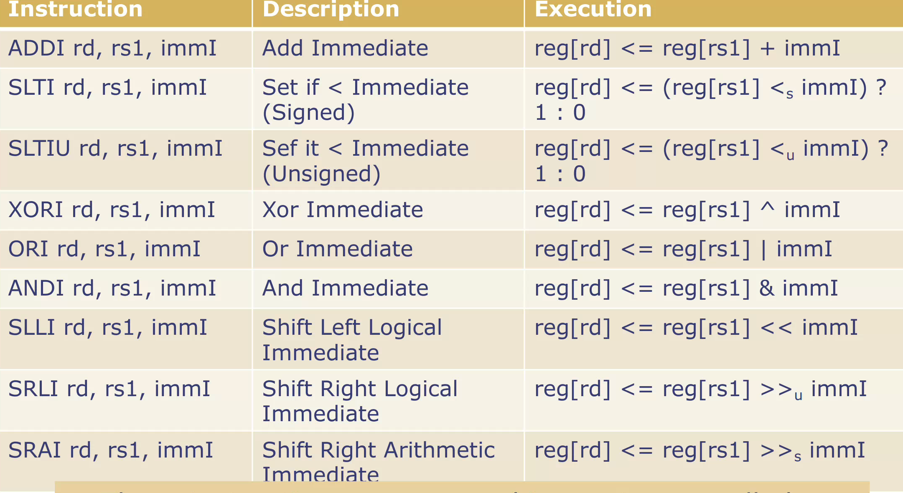
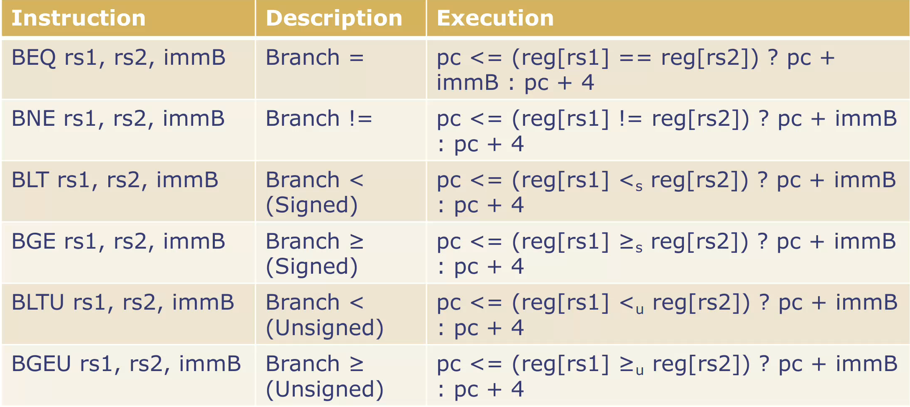
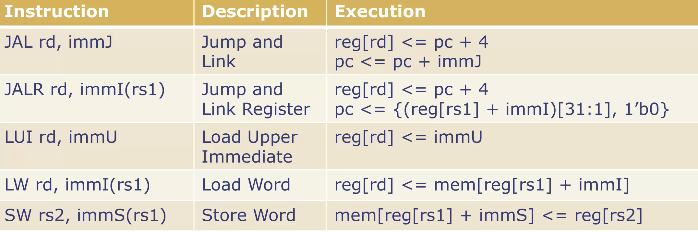

# Processor Components and Datapath

> datapath are conceptual; the real datapaths are derived automatically from the Bluespec description
## Processor Function
1. fetch the instruction at pc
2. deoce the instruction
3. Execute the instruction(compute the next state values for the register file and pc)
    - acess the memory if the instruction is a Ld or St
4. Update the register file and pc
> major components:
> register file, ALU, memory, decoder, execution unit
## Arithmetic-Logic Unit
> ALU preforms all the arithmetic and logical functions
```bsv
typedef Bit(32) Word;
function Word alu (Word a, Word b, AluFunc func);
typedef enum {Add, Sub, And, Or, Xor, Slt, Sltu, Sll, Sra, Srl} AluFunc deriving(Bits, Eq);
```
## ALU for branch Compstisons
> Like ALU but return value is a bool
```bsv
function Bool aluBr(Word a, Word b, BrFunc func);
typedef enum {Eq, Neq, Lt, Ltu, Ge, Geu}  BrFunc deriving(Bits, Eq);
```
## Register file
> Register and be rsead or write any time, sos the guards are always true
```bsv
typedef Bit#(32) Word;
typedef Bit#(5) RIndx;
interface RFile2R1W;
    method Word rd1(RIndx index) ;
    method Word rd2(RIndx index) ;
    method Action wr (RIndx index, Word data);
endinterface
```
```bsv
module mkRFile2R1W(RFile2R1W);
    Vector#(32,Reg#(Word)) rfile <- replicateM(mkReg(0));
    method Word rd1(RIndx rindx) = rfile[rindx];
    method Word rd2(RIndx rindx) = rfile[rindx];
    method Action wr(RIndx rindx, Word data);
        if(rindx!=0) begin rfile[rindx] <= data; end
    endmethod
endmodule
```
> 在某些情况下，寄存器文件（register file）的所有三个方法可以同时被调用。当这种情况发生时，如果有读取操作（read methods），这些读取操作会读取寄存器文件中已经存在的值，而不会受到其他方法同时执行的影响。这意味着，在多个操作同时进行时，读取操作依然能够获取寄存器文件中的正确值，而不会因为同时存在的其他操作（如写入）而读取到错误或未更新的值

> {rd1, rd2} < wr
## magic memory model
- 读和写的行为同寄存器一样, 并不是实际的 SRAM 或者 DRAM
    - 读是组合逻辑
    - 如果写使能有效，会在时钟的上升沿执行
- 与寄存器堆的不同在于只有一个读端口, 并且肚读和写不能同时进行
## magic memmory interface
> Magic memory can be read or written any time, so the guards are always true
```bsv
interface MagicMemory;
    method ActionValue#(Word) req(MemReq r); 
endinterface
typedef struct {MemOp op; Word addr; Word data;} 
        MemReq deriving(Bits, Eq);
typedef enum {Ld, St} MemOp deriving(Bits, Eq);
let data  <- m.req(MemReq{op:Ld, addr:a, data:dwv});
let dummy <- m.req(MemReq{op:St, addr:a, data:v});
```
## Instruction Decoding
- 指令只有在它的所有字段都被提取之后才能被执行
    - 这些字段包括访问寄存器，计算地址访问内存，ALU 的操作码，set pc
- 一些32 bit 的值并不是一条指令或者是一条尚未支持的指令
- 许多指令在译码和执行只有细微的差别


> These instructions are grouped in a category called OP with fields (func, rd, rs1, rs2) where func is the function for the ALU


> These instructions are grouped in a category called OPIMM with fields (func, rd, rs1, immI) where func is the function for the alu





## Decoded Instruction Type
```bsv
typedef struct {
    IType iType;
    AluFunc aluFunc;
    BrFunc brFunc;
    RDst dst;
    RIndx src1;
    RIndx src2;
    Word             imm;
} DecodedInst deriving(Bits, Eq);
typedef enum {OP, OPIMM, BRANCH, LUI, JAL, JALR, LOAD, STORE, 
Unsupported} IType deriving(Bits, Eq);
typedef enum {Add, Sub, And, Or, Xor, Slt, Sltu, Sll, Sra, Srl} 
AluFunc deriving(Bits, Eq);
typedef enum {Eq, Neq, Lt, Ltu, Ge, Geu} 
BrFunc deriving(Bits, Eq);
typedef struct {Bool valid; RIndx index;}
RDst deriving (Bits);
```
## Single-Cycle Implementation
```bsv
module mkProcessor(Empty);
    Reg#(Word)  pc <- mkReg(0);
    RFile2R1W   rf <- mkRFile2R1W;
    MagicMemory iMem <- mkMagicMemory;
    MagicMemory dMem <- mkMagicMemory;
    rule doProcessor;
        let inst <- iMem.req(MemReq{op:Ld, addr:pc, data:dwv});
        let dInst = decode(inst);
// dInst fields: iType, aluFunc, brFunc, dst, src1, src2, imm
        let rVal1 = rf.rd1(dInst.src1.index);
        let rVal2 = rf.rd2(dInst.src2.index);
        let eInst = execute(dInst, rVal1, rVal2, pc);
// eInst fields: iType, dst, data, addr, nextPC
        updateState(eInst, pc, rf, dMem);
    endrule
endmodule
```