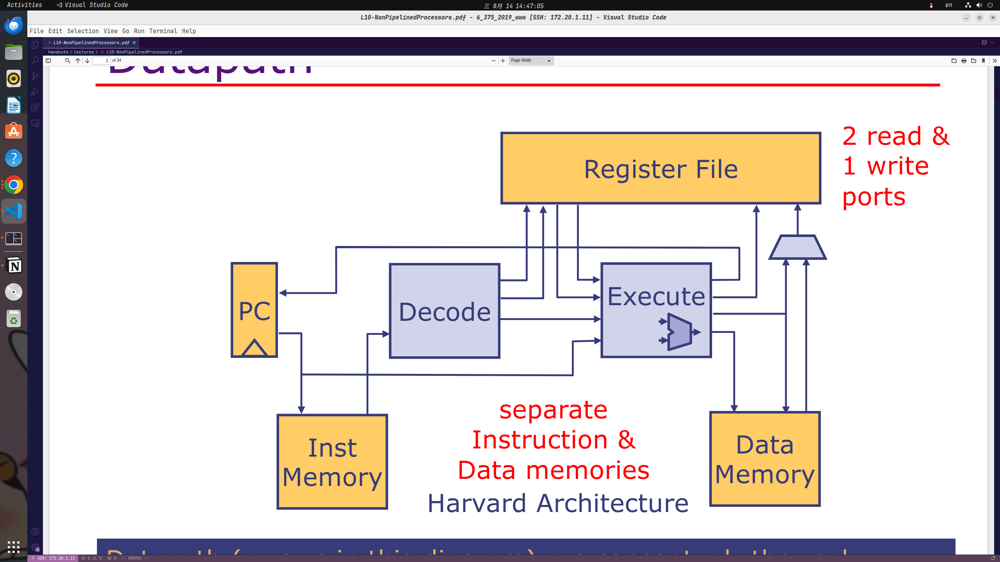

# Processor Components and Datapath

> datapath are conceptual; the real datapaths are derived automatically from the Bluespec description
## Processor Function
1. fetch the instruction at pc
2. deoce the instruction
3. Execute the instruction(compute the next state values for the register file and pc)
    - acess the memory if the instruction is a Ld or St
4. Update the register file and pc
> major components:
> register file, ALU, memory, decoder, execution unit
## Arithmetic-Logic Unit
