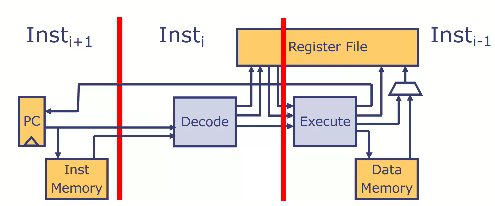

# Multicycle processors and Realisticv Memories
## Single-cycle processor
- 单周期的时钟周期取决于最长的组合逻辑路径(关键路径)
    - T > iM + DEC + RF + ALU + dM + WB
- 于是将一条指令的执行分为多个阶段，每个阶段花费一个时钟周期
    - T > MAX{iM, DEC, RF, ALU, dM, WB}
    - 这样时钟就可以更快但是一条指令的执行需要花费多个时钟周期
> 多周期执行在处理器中是不可避免的

> 比如进行一些复杂的运算, 需要多个时钟周期; 或者是访问内存, 由于内存的速度比处理器的速度慢, 也需要多个时钟周期
## Realistic Memory Interface
> Store 不需要 response; Load 按照请求的顺序依次 response
```bsv
interface Memory;
    method Action req(MemReq req); 
    method ActionValue#(Word) resp(); 
endinterface
typedef struct {MemOp op; Word addr; Word data;} 
    MemReq deriving(Bits, Eq);
typedef enum {Ld, St} MemOp deriving(Bits, Eq);
```
### Request/Response methods must be called from separate rules
```bsv
rule doFetch if (state == Fetch);
    m.req(MemReq{op:Ld, addr:pc, data:dwv});
    state <= Execute; 
endrule
rule doExecute if (state == Execute); 
    let inst <- mem.resp;
    ... decode(inst);...
endrule
```
> 在多周期处理器中, 通常需要保存指令执行的部分状态用于在后面的周期, 保证只能指令的行为正确
### Processor with realistic memory multicycle
```bsv
module mkProcMulticycle(Empty);
    Instantiate pc, rf, mem, and registers to hold the state of a
    partially executed instruction
    rule doFetch if (state == Fetch); 
        Initiate instruction fetch; go to Execute
    rule doExecute if (state == Execute); 
        let inst <- mem.resp;
        if instruction is not memory type, execute it; go to Fetch
        else initiate memory access; 
        if Store, go to Fetch (Store); if Load, go to LoadWait
    rule doLoadWait if (state == LoadWait); 
        Wait for the load value; update rf; go to Fetch
endmodule
```
## Multicycle ALU's
- 可以将 Multicycle ALU's 看作一个带有请求和响应的模块
- 指令在译码后可以分为简单的一周期, 多周期和访问内存的请求
## Processor with realistic memory and multicycle ALUs
```bsv
module mkProcMulticycle(Empty);
    Instantiate pc, rf, mem, and registers to hold the state of a
    partially executed instruction
    rule doFetch if (state == Fetch); 
        Initiate instruction fetch; go to Execute
    rule doExecute if (state == Execute); 
        let inst <- mem.resp;
        if instruction is not memory type, execute it; go to Fetch
        else initiate memory access; 
        if instruction is memory type, initiate memory access
        if Store, go to Fetch (Store); if Load, go to LoadWait
        if multicycle instruction; initiate it; go to MCWait
    rule doLoadWait if (state == LoadWait); 
        Wait for the load value, update rf, go to Fetch
    rule doMCWait if (state == MCWait); 
        Wait for MC value, update rf, go to Fetch
endmodule
```
## Multicycle RISC-V
> 在多周期的处理器中, 指令是一条执行结束后下一条指令才会开始执行. 这就导致有许多周期的硬件资源被浪费了. 于是出现了流水线处理器用于提高处理器的吞吐量
### Pipeline the provessor to increase its throughput

- 推测执行是一种处理器优化技术，处理器在执行过程中会预测即将执行的指令，并提前执行这些指令，即使它们的执行顺序还未被最终确认。这种方式可以提高流水线的效率，因为即使处理器遇到需要等待的数据或条件，它也可以继续执行推测的指令，避免浪费时间.
- 需要处理流水线中的各种反馈
    - 很容易导致流水线的功能错误
## 流水线中的新问题
### 控制冲突
> 在第 i 条指令完成译码之前, 不知道第 i+1 条指令的 pc

- 通过预测和在预测失败后纠正错误解决
1. 取值阶段发起取值请求, 然后通过 f2d 将数据发送到执行级, 推测下一个 pc 是当前 pc 的值加上4
2. 执行级接收从取指级发送的指令并且执行它. 可能需要花费一个或多个时钟周期
3. 这两个阶段独立运行, 除非分支预测错误, 在执行级会将 pc 重定向到期望的值

- 如何判断分支预测失败
    - 在取指级根据 pc 的值发起一个取值请求并且预测下一个 pc
    - pc 处的指令在流入流水线的时候会带着 nextpc 一起进入流水线
    - 在执行级可以拿到正确的 nextpc 的值, 如果 ppc != nextpc 就说明分支预测错误
- What does it mean to squash a partially executed instruction
1. 被取消的指令不应该改变处理器的状态
    - 不能更新寄存器堆和 pc
    - 不能发起写内存的请求
2. 这些条件可以很容易的保障这个两级流水线处理器因为至多一条指令的在 EX/LW state

Epoch: a method to manage control hazards
- 添加一个用于保存处理器状态的 Epoch 寄存器
- 只要发现分支预测错误, 执行级就会更新 Epoch 寄存器的状态并且设置正确的 pc
- 取指级将当前的 Epoch 与发送到执行级每一条指令关联起来
- 当指令准备执行时会检查 Epoch 寄存器, 如果 processor epoch 发生了变化该指令将会被抛弃
### 数据冲突
> 第 i 条指令的执行可能依赖第 i-1 条指令执行的结果, 所以需要等待上一条指令的对处理器状态的改变完成

- 阻塞流水线直到该条指令的依赖被解决
- 可以通过旁路减少阻塞, 需要添加额外的数据通路

- 数据冒险是取指级的源寄存器和流水线中正在执行的目的寄存器相同
- 并且源寄存器和目的寄存器都是有效的, 数据冒险才会存在

解决数据冒险的方案
- 使用计分板 -- 这是一种用于追踪处于流水线译码级之后的指令的目的寄存器的一种数据在结构
    - 将计分板初始化为空
- 在译码的时候比较指令的源寄存器和计分板上的目的寄存器
- 如果存在 RAW 冒险, 译码器将会被阻塞不会继续分配指令到执行级
- 当指令被分派后, 更新它的目的寄存器到计分板上
- 当一条指令执行完成后, 将它在计分板上的数据删除
### 计分板
- method insert: 在译码期间, 将有效指令的目的寄存器或者是无效值插入计分板
- method search1: 将指令的源寄存器与计分板上记录的信息比较, 判断是否出现数据冒险
- method search2: the same as search1
- method remove: 当指令提交后删除在计分板上的信息

Two dasign for scoreboard
- Fifo
    - 深度同流水线级数的 fifo
    - Insert: 将指令的目的寄存器入队
    - Remove: 将提交后的指令的数据出队
    - Search: 将指令的源寄存器同计分板上的条目一一比较
- Flag or counter
    - 每一个寄存器都有一个 Flag(初始化为 False)
    - Insert: 将对应的 rd 寄存器的标志位更新为 True(如果已经是 True, 就阻塞)
    - Remove: 将对应寄存器的标志位更新为 False
    - 返回对应源寄存器的标志位的值
> 使用计数器的硬件资源消耗更少, 尤其是在深度很高的流水线中, 它避免了去查找 fifo 中的每一个元素, 效率也会更高

流水线中的计分板
